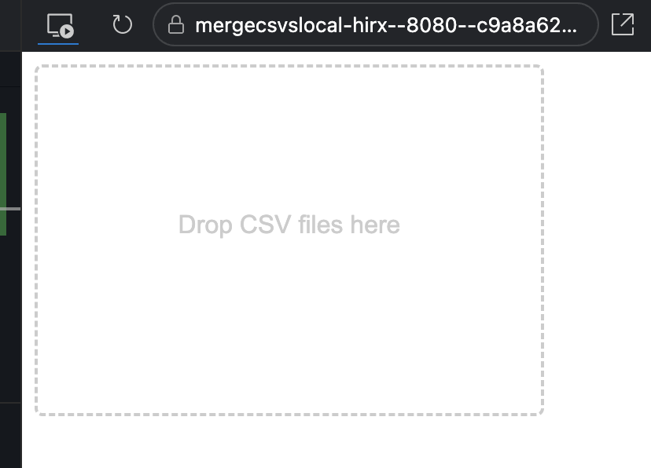

# merge-csvs-local

Simple tool to drop a stack of CSV files and merge together with a single header row.

Assumes that all data files have the same columns.

## Visuals

## Background

Built from this ChatGPT discussion: https://chat.openai.com/share/a6d51e52-78a9-445f-8ced-a48a451ec8cf

[Edit in StackBlitz next generation editor ⚡️](https://stackblitz.com/~/github.com/byronwall/merge-csvs-local)